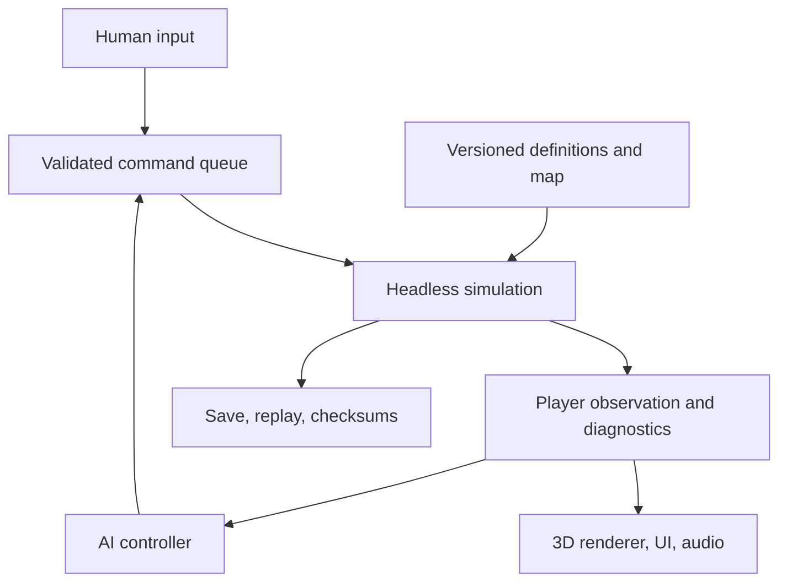

# Supply Front — System Design and Build Roadmap

**Status:** implementation plan based on *Supply Front Game Design Document*, version 0.1 (3 October 2026)  
**Target:** PC, overhead 3D, offline 1v1 first; eventual competitive 1v1 and possible 2v2  
**Rule of precedence:** the game design document (GDD) defines intended player-facing rules. Values in it are initial tuning data, not measured balance results. This document defines an implementation approach and explicitly marks choices that still need a prototype decision.

## 1. Product boundary and technical decisions

The playable core is a connected chain: finite deposits → local production → truck delivery → warehouse or forward depot → supplied army → territory and victory. The same physical goods must be visible in inventories, vehicle manifests, unit stocks, and salvage. The player sets policies and issues orders; automation executes them and explains failures.

| Area | Initial decision |
| --- | --- |
| Runtime | C++20, CMake, raylib for window/input/overhead 3D rendering; EnTT for runtime entity components; JSON for validated definitions; a C++ test runner for headless simulation tests. These retain the useful direction of the earlier system design and are provisional until the first vertical slice. |
| Simulation | One authoritative headless simulation at a proposed 10 ticks/second. Rendering may run at a different frame rate and interpolate visuals. Offline pause and speed controls advance zero or multiple fixed ticks, never a variable length tick. |
| Data | Integer cargo units and stable IDs; integer or fixed-point positions, timers, rates, and fuel accumulation in authoritative logic. All numerical rules live in versioned content definitions. |
| First playable | One graybox 1v1 map, scripted opponent, all ten cargo types, six unit types including trucks, construction/power/research/recovery, road transport, forward depots, combat, sectors, and the full victory loop. |
| Later gates | Operational AI, the River Crossing tutorial, save/replay, multiplayer trial, and stress profiling in the vertical slice. A production network model is chosen after profiling and replay checks. |
| Deferred | Railways and trains, aircraft, naval transport, extra factions, detailed belts, weather, campaign persistence, ranking, and cosmetic progression. No train scheduler or rail graph belongs in the baseline architecture. |

The engine and library selections are project choices, not rules from the GDD. If overhead 3D readability or target performance fails, review the rendering stack without changing the simulation's command or state model.

## 2. System shape and ownership

The simulation owns every gameplay fact. UI, rendering, audio, and human or AI controllers consume a filtered read model and submit commands; none writes entity state directly.

| Module | Owns | Does not own |
| --- | --- | --- |
| Game application | Window, input mapping, camera, scene renderer, audio, UI, screen/world picking | Rules, stock counts, legal orders |
| Game session | Players, match clock, command sequencing, pause/speed in offline play, save/replay coordinator | Per-entity production or movement logic |
| Simulation | ECS registry, stable entity IDs, world structures, inventories, jobs, RNG, orders, events, victory | Assets, UI widgets, frame time |
| Definition database | Validated item, recipe, building, unit, weapon, map and tuning definitions with content version/hash | Mutable inventories and runtime positions |
| World services | Terrain/build occupancy, deposits, combat navigation, road graph, cable connectivity, spatial lookup, visibility | Generic global pathfinding for every vehicle |
| Presentation read model | Own-player exact facts, enemy facts allowed by visibility, causal diagnostics, route/army estimates | Hidden enemy inventories or authority to change simulation |

Keep entity components simple: Position, Owner, Health, Vision, Inventory, ProductionCycle, ConstructionSite, PowerConsumer, PowerSource, RoadUser, Hauler, OrderQueue, Weapon, CarriedSupply, DepotService, StoragePolicy, and CaptureProgress are examples. Systems hold behavior. An entity has a stable serialized GameEntityId; an EnTT handle is an internal lookup that can change across loads. Definitions are referenced by stable IDs, not copied into each entity.

The map uses specialized representations. Terrain and build occupancy answer placement and cover questions; a combat navigation grid handles ground units; a road graph handles truck routes, speed and edge entry capacity; cable connected components handle local power; spatial indices answer nearby service, combat and sight queries. A bridge is a damageable world entity linked to one road edge. Editing or destroying it invalidates affected cached routes. Road graph routing remains authoritative for trips, including permitted off-road connectors at 4 m/s; an unconstrained tile A* must not bypass a closed bridge or a player's route policy.

In 3D the ground plane is the simulation's X/Z plane. Camera and mouse picking convert screen coordinates to a ground point; simulation coordinates remain independent of raylib vectors. At strategic zoom, traffic can be drawn as aggregated flow, while each truck, manifest, collision exposure, and route remains simulated.

## 3. Simulation and command contract

### Fixed update

Use an integer tick counter and a recorded seed. Store authoritative positions at fixed precision (for example millimeters in signed 64-bit integers), velocities or per-tick advances as integers, and rates as integer numerators with carry accumulators. Cargo inventories stay whole numbers even when a rate is fractional: a 1.5 fuel/minute vehicle accumulates consumption deterministically and removes a whole fuel unit when the threshold is reached. The same approach drives extraction, depot service, generator consumption and victory timing. Presentation interpolation may use floats.

At each tick, run a stable phase order:

1. Accept commands for this tick ordered by tick, player and per-player sequence; validate ownership, visibility, cost, range and policy. Record accepted/rejected outcomes.
2. Apply placement, route, road and cable edits; update graph/component versions and invalidate affected paths.
3. Allocate power by connected component and configured consumer priority; advance or finish extraction, recipes, research, unit queues and construction, including explicit stock transfers.
4. Recompute inventory offers and deficits. Every tenth tick or on a material route event, generate and dispatch transport jobs.
5. Advance bay/edge queues, trucks, loading, travel, unloading and rerouting; transition reservations atomically.
6. Resolve combat-unit orders and movement; update visibility and target eligibility.
7. Resolve weapon bursts, projectiles, armor/cover, damage and supply expenditure.
8. Allocate depot service, repairs and unit supply states; schedule optional sustain/return behavior.
9. Resolve deaths, storage capture, bridge state, salvage, sector control, score and win conditions; release invalid claims.
10. Produce events, causal status and a visibility-filtered read snapshot at a consistent tick boundary.

The ordering above is an engineering choice. Tests must assert its consequences, especially a road closing during a delivery, a destroyed destination, and simultaneous claims on the last cargo. Avoid dependence on unordered container iteration or wall clock time; tie-break by stable ID. Simulation RNG is seeded and serialized. AI observes a completed tick and submits commands for a later tick.

### Command, event and observation boundaries

Commands express intent: move/attack/escort, place/cancel/repair, choose recipe or unit queue, set warehouse floor and target, create or edit a declared route and corridor, assign truck pool, change stance, and research. A command must return a reason when rejected. Events record completed facts such as produced cargo, loaded manifest, blocked route, depot transfer, loss, capture and victory; they drive feedback and replay inspection but are not an alternative source of truth.

Human and AI controllers use the same command validator. The AI receives the same player-visible observation as a human: enemy units and truck movements under line of sight, never exact hidden enemy stock, queues or route claims. Debug omniscience is a separate test mode. Selection, control groups, shift queues and contextual right click translate into commands, not direct component mutations.

### Save, replay and network seam

A snapshot includes tick and seed/RNG state; stable entities and components; inventory and deposit quantities; active cycles and queues; power and graph versions; routes/policies; source, destination and vehicle claims; truck manifests, assignments and edge/bay queues; orders and AI state; visibility and objective scores. Save at a tick boundary. Include content schema version and definition hash and either migrate or reject incompatible saves explicitly.

Replay records initial map/content version, seed and accepted commands (including AI choices) by tick, plus periodic state checksums. A headless replay must reproduce the same checksums under different rendering frame rates. Load a save while a truck is loaded and blocked, then verify the goods and claims are unchanged.

For the vertical slice, prototype authoritative multiplayer state and replay checks. Choose deterministic lockstep versus server synchronization only after profiling simulation cost, cross-machine reproducibility, latency and bandwidth. This is not needed for the first offline build; command IDs and stable state serialization keep the choice open.

## 4. Goods, production and progression

### Definitions and physical ledger

The ten cargo IDs are iron ore, copper ore, crude oil, metal, wire, parts, electronics, fuel, ammunition and construction kits. A unit of any cargo uses one inventory slot. Definitions contain recipe input/output, cycle ticks, buffer caps, power draw, build cost/time, unit recipe, carry capacity and demand rate. Startup validates IDs, positive quantities, legal destinations, capacities, recipe cycles, costs and map references.

| Output | Baseline conversion | Cycle / source rate |
| --- | --- | --- |
| Iron ore, copper ore, crude oil | Finite mine/pump deposit → local output | 60 units/minute per extractor |
| Metal | 2 iron ore → 1 metal | 2 seconds |
| Wire | 1 copper ore → 2 wire | 2 seconds |
| Parts | 2 metal → 1 part | 4 seconds |
| Electronics | 1 metal + 3 wire → 1 electronics | 5 seconds |
| Fuel | 1 crude oil → 2 fuel | 2 seconds |
| Ammunition | 1 metal → 4 ammunition | 2 seconds |
| Construction kits | 2 metal + 1 part → 1 kit | 4 seconds |

A machine shop runs one selected parts or kits recipe at a time. Processors hold 30 of each input and 60 of each output. Vehicle factories hold 60 of each recipe input and 120 each of fuel and ammunition for starting loads. Reserve capacity for the full recipe output before starting a cycle; completion fills that capacity, even if deliveries arrive meanwhile. Full output stops a new cycle. On cycle start, the complete recipe must be locally present and reserved, then consumed once; output appears only on completion. An interrupted unstarted cycle releases claims; a powered-off running cycle pauses without losing already consumed inputs. Destruction loses unfinished work and physical inventory according to the relevant destruction rule.

Use one transaction API for stock changes. Physical goods exist only in an inventory (building/site, truck, unit, crate) or a deposit before extraction. Claims refer to goods or free space; they are never counted as extra stock. For each cargo, a conservation ledger reconciles extraction and recipe outputs with physical stock plus explicit recipe inputs, construction/unit/research costs, combat/fuel/repair use, drops and destruction losses. The ledger is diagnostic, not a second inventory.

At any endpoint, unclaimed stock = physical stock − all claims against that stock; outbound offer = max(0, unclaimed stock − protected floor); inbound free = capacity − physical stock − all inbound space and pending recipe-output claims. Use nonnegative bounded arithmetic and check both per-item buffer and total capacity. Factory input claims, shipment source claims and construction kit claims cannot spend the same goods. The HUD separates physical, claimed and in-transit totals; global totals never authorize local spending.

### Construction, power, research and recovery

The World War II era starting base is a field HQ, engineer squad, diesel generator, warehouse, three trucks and infantry squad beside starter deposits. The warehouse begins with 60 kits, 30 parts, 20 electronics, 120 fuel and 160 ammunition. The generator starts empty; initialize a declared warehouse-to-generator fuel delivery connection so the truck pool supplies it through ordinary claims and delivery, without adding starter stock. The opening requires oil extraction and refining before reserves run out; 120 fuel supports one generator for 20 minutes if vehicles consume none. Engineers place sites; an eligible warehouse claims and delivers kits; engineers then assemble. If engineers are lost, HQ can assemble nearby sites using an adjacent warehouse. Cancel releases undelivered claims; delivered kits become a physical crate. Building costs and times are definition data from GDD §4.

Cable connectivity partitions the power network. Mines/smelters/refineries draw 1; other production/research buildings draw 2. A diesel generator supplies 10 while running and consumes 6 fuel/minute from its 60-fuel local inventory. Treat generators as fuel delivery destinations. Empty or player-switched-off generators supply no power and consume no fuel. Oil pumps and refineries require generator power, so fuel production must be established while starter reserves remain. Storage, loading, infantry training and depot service need no power. Allocate in stable player-set consumer priority order; pause affected cycles without duplicating inputs. Cable reach/connection details need an early map/UI prototype.

The HQ trains infantry and engineers; a vehicle factory builds scouts, tanks, artillery and trucks from its local inputs. Parts and starting loads must reach the producing HQ or factory through eligible local stock or a declared delivery; there is no global resource pool. A research lab takes 12 electronics and 8 parts over 90 seconds to unlock tanks and artillery faction wide. Consume unit inputs at queue start; a canceled unit order returns 80% of each input rounded down, with overflow in crates and the remainder logged as an explicit sink. Starting fuel/ammunition must be loaded from the producer's local stock before release. An HQ emergency workshop may generate at most 6 kits and 6 parts per match, only when those stocks and active production are empty; track the lifetime allowance in the save. Dirt roads can be engineer placed immediately; pavement costs kits.

Finite starter deposits should sustain about 20 minutes of typical use; warn at 25% remaining. Exact deposit quantities are map data and require playtesting.

## 5. Transport, claims and recovery

### Declared network and policies

A directed logistics connection names source, destination, permitted cargo, priority, optional waypoint corridor and danger permission. Factories request recipe inputs, warehouses/depot request toward per-item targets, construction sites request kits, and salvage collection requests crates. A warehouse holds 2,000 units; a forward depot holds 600 and accepts fuel, ammunition and parts. Targets must fit capacity. A minimum stock threshold triggers replenishment toward the target; a reserve floor protects source stock until explicitly lowered. Direct processor-to-factory connections are allowed when declared. Automatic relay matching follows declared edges and refuses cycles; no inferred warehouse transfer loop.

When usable physical stock plus inbound cargo reaches the minimum threshold, a target policy requests no new shipment; below it, request up to target minus physical and inbound, bounded by unclaimed free space. Factory demand follows the queued recipe's missing local inputs. Offers use surplus above floor and existing source claims. Dispatch classes are emergency defense, frontline supply, production, then reserve filling. Within a class use oldest eligible request, estimated journey time and stable IDs as tie-breakers. Batch permitted goods to 40 slots, wait at most 10 seconds for a fuller load, or send emergency cargo immediately. A job claims source stock, destination capacity and one pool truck before loading. A truck belongs to a warehouse pool until temporarily taken for direct emergency control; it rejoins the pool after a safe return.

The trip state machine is assigned → to source → bay queue → loading → en route → edge/bay queue → unloading → return to a safe source → idle. Loading and unloading each take 5 seconds per trip. Source stock becomes a truck manifest only at loading; the source claim is then released, while the destination's inbound capacity claim remains until unloading. Unloading transfers exact manifest quantities to the destination and releases their claims atomically. After a completed or aborted job, return to the pool warehouse or another reachable safe source if it is gone; do not mark the truck available during the empty return.

### Road routing and failure rules

A truck drives 8 m/s on dirt, 12 m/s on pavement, and 4 m/s off road. Truck travel consumes no fuel in the baseline. Ordinary road edges admit one truck per second per direction; bridges admit one every two seconds total. Warehouses have two bays, producers and depots one. Trucks may pass friendly units but queue at constrained edges and bays. The graph scheduler owns admission times; local motion spaces the visible vehicles without changing throughput accounting.

Use a valid player corridor before the shortest permitted alternative. Default routing avoids visible enemies and known enemy control; fogged paths are allowed and labeled uncertain. Never override a locked corridor or enter known hostile control without player permission. Road condition reduces edge speed before complete blockage; a destroyed bridge blocks its edge. Edits invalidate affected paths and travel estimates. A blocked load seeks a permitted detour. If none exists, release its original inbound claim and route it, still loaded, toward a reachable safe friendly warehouse with newly claimed space. If safe storage is temporarily unavailable, retain its manifest in a visible holding state and raise an alert; the goods do not disappear. A destroyed truck loses its manifest. Destination destruction or capture releases its inbound claims and triggers job repair/return. A captured storage endpoint changes ownership, retains surviving stock, clears old routes and claims, and requires new friendly connections. Handle jobs in stable order so simultaneous changes cannot overbook stock or bays.

After 15 seconds without progress, group alerts by root cause (bridge, bay, no safe route, no stock) and expose affected jobs and alternatives. A route panel shows source, destination, cargo, pool vehicles, last successful delivery, journey time, edge/bay queues, and estimated delivery capacity. A 600 m paved journey each way with 10 seconds handling is about 110 seconds per round trip and 21.8 cargo/minute per full truck before queues; use this as a calculation test, not a performance guarantee.

## 6. Combat, local supply and objectives

Combat movement uses terrain navigation and lightweight avoidance, separate from road-graph logistics. Stances are hold, cautious advance, assault, escort and return to depot. Target acquisition uses player vision, line of sight and stance; indirect artillery fire requires a spotter or a player-selected ground location at reduced accuracy. Weapons resolve bursts, travel, cover and directional armor through data definitions; there are no repeatable activated abilities in the baseline. The GDD leaves weapon health, ranges and accuracy for combat prototype tuning. A shared ammunition cargo pays for each weapon burst; vehicles use fuel while moving, never while idle. Supply exhaustion causes behavior changes rather than direct damage.

| Unit | Build cost and time | Fuel / ammo capacity | Maximum fuel / ammo use per minute |
| --- | --- | --- | --- |
| Infantry squad | 2 parts, 15 s | 0 / 20 | 0 / 4 |
| Engineer squad | 2 parts, 20 s | 0 / 10 | 0 / 2 |
| Scout car | 3 parts + 1 electronics, 20 s | 20 / 12 | 1 / 3 |
| Tank | 10 parts + 3 electronics, 45 s | 40 / 30 | 2 / 6 |
| Artillery vehicle | 8 parts + 4 electronics, 50 s | 25 / 40 | 1.5 / 12 |
| Supply truck | 2 parts, 15 s | 40 cargo slots | No fuel or ammo use |

Infantry is one five-person squad with one shared stock. Engineers can carry 10 repair parts in addition to ammunition; one part repairs 10% maximum health, drawn from carried parts or a nearby depot. A tank's 40 fuel supports 20 minutes of continuous movement at the initial rate; these budgets are tuning values.

A forward depot serves friendly units within 60 m from its physical stock, with 120 total cargo units/minute across all units and item types. Selected groups have priority, then units with lowest supply percentage, then stable ID. Service uses its own fixed-point rate budget. Trucks replenish depot storage, never units directly. A unit at or below 25% of either carried resource raises a grouped low supply state. Zero ammunition disables weapons; zero vehicle fuel permits only 15% crawl without dash, tow or road-speed bonus. Default stance warns and continues orders. Optional sustain returns to a reachable safe depot and resumes the old assignment only if the player enabled resume. Depot access, carried stock, current/projected consumption and service capacity must be visible together.

The reference map is roughly 2 × 2 km: modest home deposits, larger contested deposits, three center sectors and at least two ground corridors to the contested region. After five opening minutes, a player holding at least two sectors gains one point/second; first to 900 points or destruction of the opposing HQ wins. Points never decrease. Uncontested infantry capture a sector in 20 seconds; vehicles alone do not. Warehouse/depot capture takes 30 uninterrupted seconds beside it with no defending combat unit within 60 m. Destroyed storage drops 25% of stock as salvage crates and loses the rest. Road damage slows traffic before an edge blocks; engineers rebuild a destroyed bridge for 4 delivered kits over 45 seconds. Demolition takes 20 seconds and incoming damage cancels it. The map must preserve an alternate corridor.

## 7. Observability, AI and performance

### One causal model for UI and AI

Each important object exposes a typed status with the constraining stage and a trace back to its cause: missing input → source output and stock → reservation or bay → truck/edge/route → destination capacity → power or production cycle. The UI and AI consume the same throughput and endurance estimator over the observation they are allowed to see. Nameplate rates are shown separately from completed output; projections display assumptions and say stable when delivery meets projected use.

The normal view prioritizes armies, depots and sectors, with visible score, estimated time to victory and a compact stored/claimed/in-transit cargo overview. The logistics overlay shows directed sources and destinations, cargo mix, flow versus capacity, blocked and uncertain segments, with icons/text in addition to color. Warehouse panels show physical stock, floors, targets, inbound claims and bays; factory panels show queue, local stock, output and current constraint; army panels show resource bars, reachable depot and endurance. Strategic zoom can aggregate traffic visually. Alerts group a root cause and link affected destinations rather than issuing a warning for each factory. State changes such as stalled production, convoy arrival, low supply and capture need readable visual and audio feedback even in graybox form. Include remappable controls, scalable text, color-independent cues, reduced camera motion and adjustable alert audio.

The first enemy is scripted but uses legal commands. The vertical-slice planner builds a viable metal/kit/parts/ammunition chain, estimates army demand, sets reserve targets and truck capacity, secures a reachable depot, then chooses defense, raid, detour, attack or withdrawal from sector value, route exposure, known enemies and reserves. Difficulty adjusts planning depth, reaction delay and risk tolerance. It cannot query hidden opponent inventory. Keep the planner's demand/route forecasts and diagnostic explanations shared with the player read model.

Profile simulation and rendering separately on a declared reference PC. Prototype stress scenes contain 200 combat entities, 150 trucks and 100 industrial/storage buildings across both players. Later 2v2 target is 600 combat entities and 300 trucks. These are budgets to measure, not promises. Track tick time by movement, path service, visibility, targeting, dispatch and presentation. Queue path requests and cache graph routes; add flow fields, hierarchical navigation or multithreading only after a representative profile shows a need.

## 8. Build roadmap: playable steps and exit gates

Each step ends in a build that exercises its new rules through the ordinary command path. Keep content values in definitions and run headless fixtures for invariants. The stages are dependencies, not calendar estimates.

| Step | Build and implementation order | Exit gate |
| --- | --- | --- |
| **0 — Foundation** | Establish CMake/raylib overhead 3D window, ground picking, camera/selection, headless simulation target, stable IDs, 10 Hz command log, definitions validator and a two-corridor graybox map. Add pause, speed controls and checksum runner. | Same seed and command log yield identical authoritative checksums at different render rates and after pause/speed changes; selecting and ordering units touches state only through commands. |
| **1 — Local economy harness** | Implement inventory transactions, finite extraction, all ten cargo types and recipes, per-building buffers, warehouse floors/targets, construction-site and crate state, local power, HQ recovery, research and unit queues. Use a preplaced chain with seeded local inputs while delivery is under construction. Build basic factory/stock panels that name missing input, power or output space. | Commands run a preplaced chain and expose each production stop with a source and map link; deterministic fixtures show no negative stock, duplicate claims, overflow or unexplained goods. A new site can request kits but waits for Step 2's truck delivery. |
| **2 — Complete economy sandbox** | Add declared logistics links, request/offer planner, claims and 40-slot pool trucks; road graph, dirt/paved/off-road speeds, bridges, bay/edge admission, batching, detour/retreat/loss and route overlay. Test a bridge closure while loaded. | From the finite starting warehouse, a player delivers kits, builds the metal → parts/kits → electronics/ammunition chain and produces a loaded vehicle. A blocked route explains its source, failing edge/bay and alternatives. Inventory plus manifest balances before and after damage, capture and cancellation. |
| **3 — Combat supply prototype** | Add combat navigation, visibility/LOS, cover/armor/projectiles, the full roster, unit starting loads, fuel/ammo use, depot service, repairs, supply states and stances. Stage a prepared assault and corridor raid. | A reserve-supported attack can briefly exceed production; a cut leaves at least 60 seconds of effective local fighting stock and one reachable fallback in the seeded test. Depleted units behave as specified and depot service never exceeds its stock or rate. |
| **4 — Objective match** | Add sectors, score, HQ win, infantry and warehouse capture, salvage, bridge repair/demolition, map deposits and two viable corridors. Put a scripted enemy on the reference map. | New testers can finish an offline 1v1 from finite starting resources and can recover after a route raid; the three required situations in GDD §14 occur in an ordinary match. |
| **5 — Integrated feedback pass** | Expand the warehouse, factory, route and army panels; strategic logistics overlay, causal alerts, consumption/throughput/endurance forecasts, controls/accessibility and lightweight state/audio feedback. Add a short familiarization scenario and instrument attention and outcomes. | After familiarization, at least 80% of testers fix a seeded input or route shortage within 30 seconds; median stable-operation logistics interaction is below 35% of active time. Testers can name the limiting stage and take a useful action. |
| **6 — Vertical slice** | Replace script with visibility-limited operational AI; build the River Crossing tutorial and restart/debrief; implement snapshot save/load and command replay; trial authoritative multiplayer and profile stress scenes. | Interrupted deliveries survive save/load and replay checksums; AI follows the same commands/predictions; the tutorial demonstrates a prepared offensive, bridge cut and three responses; prototype stress budget is measured with declared hardware and tick times. |
| **7 — Production decision and expansion** | Review economy, raid recovery, attention and performance evidence; tune or simplify. Only then add maps, focused missions, art/audio polish and 2v2 experiments. | Commit to production scope only when players can fight while automation runs, explain a raid's consequence and improve their network. Do not add rail until truck throughput proves a useful strategic ceiling. |

### Test fixtures and telemetry

- **Conservation:** for every cargo ID, track exact sources, conversions, physical holders, crates and explicit sinks over thousands of ticks. Check source stock, inbound capacity, truck exclusivity and no relay cycles under simultaneous orders.
- **Lifecycle:** cancel a build after delivery, stop power mid-cycle, cancel unit production with rounding/overflow, destroy a loaded truck, capture a warehouse, close a bridge while a truck is queued, and load a save during a blocked delivery.
- **Rates and routes:** compare the 600 m/40-slot truck throughput example, enforce bridge/normal-edge admissions and bays, and verify depot 120 units/minute aggregate service and fractional fuel accounting.
- **Match and information:** reproduce capture interruption, sector scoring after five minutes, HQ destruction, hidden enemy stock, command rejection under fog, AI reaction delay, and replay checksum divergence diagnostics.
- **Playtests:** log bottleneck discovery time, interaction time by combat/logistics, delivery and reserve history, route interruptions, recoveries, objective choice and match duration. Use the GDD §15 thresholds as proposed gates, then tune with observed matches.

## 9. Decisions to resolve through prototypes

| Question | Prototype evidence needed |
| --- | --- |
| How much carried and depot reserve makes raids consequential but recoverable? | Seeded cuts, time to warning/response, retreat success, and stock histories under real combat. |
| Does local power add a worthwhile decision, and how should cable attachment be indicated? | Observe whether players understand shedding and deliberately prioritize consumers; test connection readability on a dense base. |
| When should direct processor-to-factory routes beat warehouses? | Measure throughput, bay contention, trips and player attention across both layouts. |
| How strict should road/bridge admission and capture/demolition times be? | Compare queue frustration, defensible alternatives, offensive windows and match pacing. |
| Does 15% emergency crawl preserve recovery without trivializing fuel? | Test pursuit, escape and depot reach under depleted fuel. |
| Which multiplayer synchronization approach fits? | Profile fixed-tick cost, replay equivalence across target machines, command latency and snapshot bandwidth after the offline core works. |

Do not turn these questions into hard-coded balance assumptions. The first production commitment depends on the GDD's legibility, recoverability, reserves and expansion gates, not on the amount of content built.
